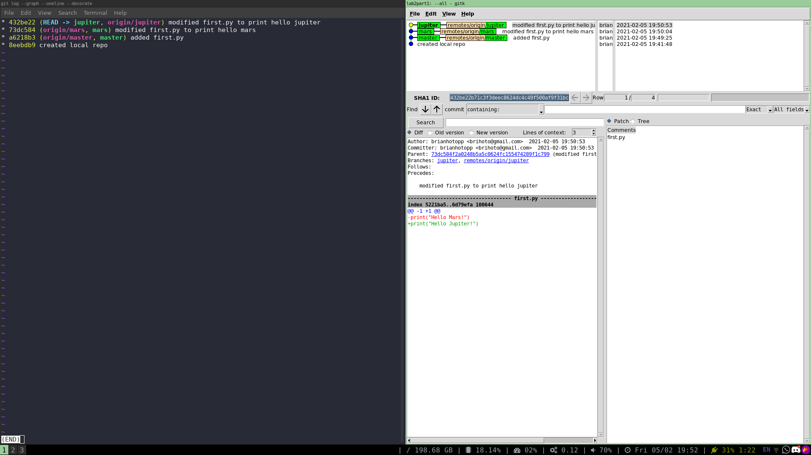
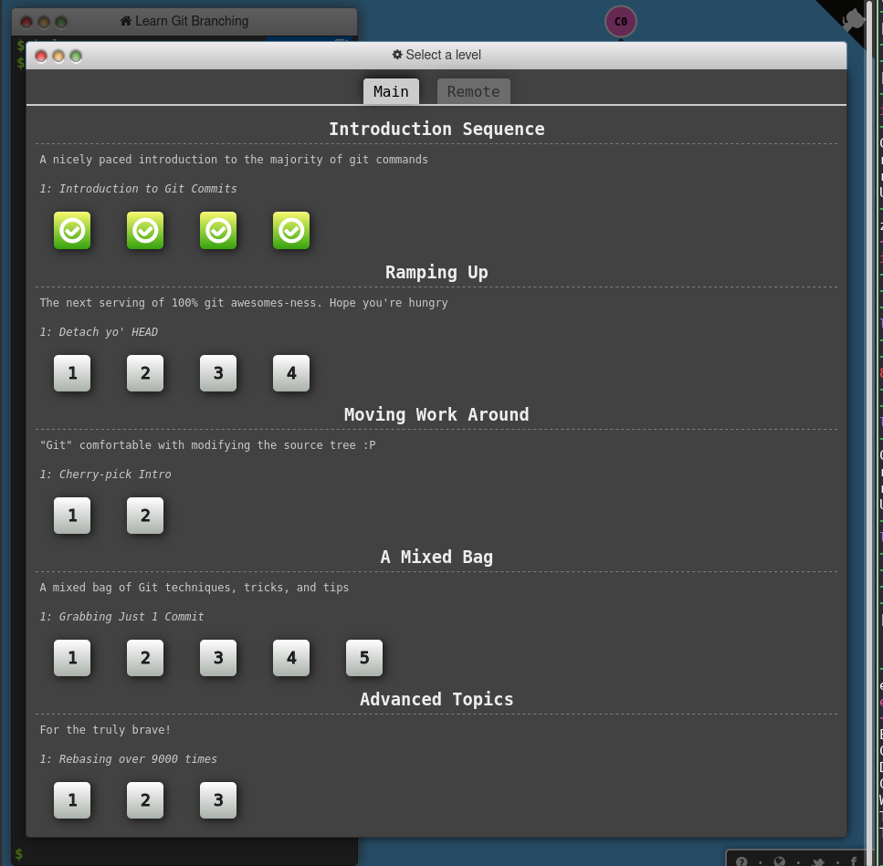
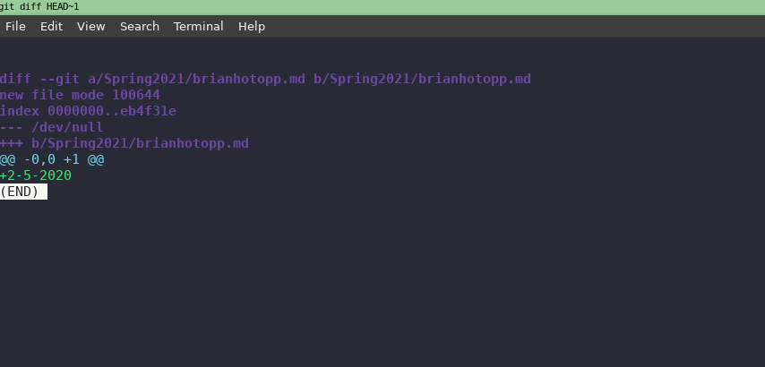
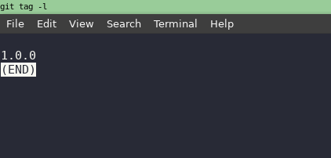

Part 1:

link to my local repo: 

https://github.com/BrianHotopp/lab2part1

Part 2:

Link to my fork of Spoon-Knife:

https://github.com/BrianHotopp/Spoon-Knife

Git activity:

Part 3:

my fork of pullreq:

https://github.com/BrianHotopp/PullReq

git diff: 

git tag: 

link to my fork of projectIdeas: 

https://github.com/BrianHotopp/OSSProjectIdeas