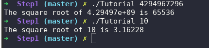
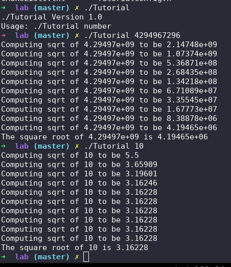
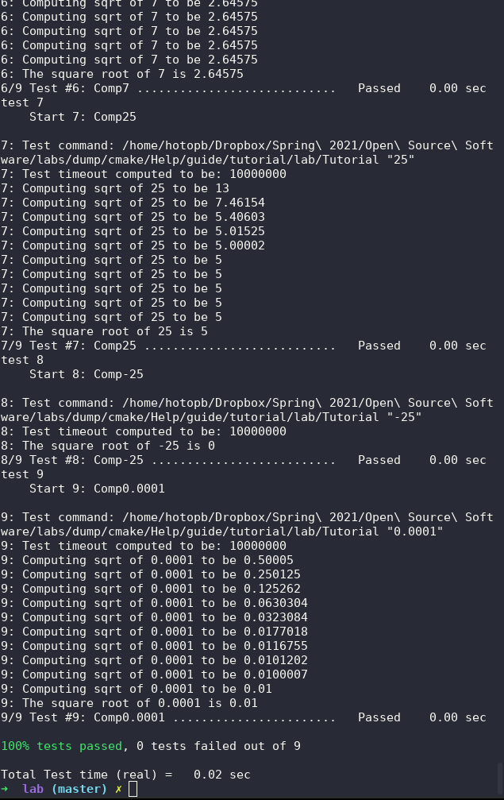
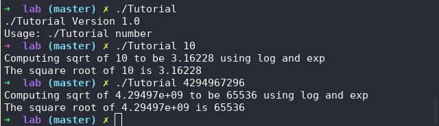

# Brian Hotopp

# Lab 05

### Part 1

**Steps 1 and 2 (cmake)**

Code:

```c++
 #include <cmath>
 #include <iostream>
 #include <string>
 #include "TutorialConfig.h"
 #ifdef USE_MYMATH
 #include "MathFunctions.h"
 #endif
 int main(int argc, char* argv[])
 {
   if (argc < 2) {

     std::cout << argv[0] << " Version " << Tutorial_VERSION_MAJOR    << "."
               << Tutorial_VERSION_MINOR << std::endl;
     std::cout << "Usage: " << argv[0] << " number" << std::endl;
     return 1;
   }
 
   // convert input to double
   const double inputValue = std::stod(argv[1]);
 #ifdef USE_MYMATH
   const double outputValue = mysqrt(inputValue);
 #else
   const double outputValue = sqrt(inputValue);
 #endif
 
   std::cout << "The square root of " << inputValue << " is " <<      outputValue
             << std::endl;
   return 0;
 }

```


CMakeLists.txt:

```cmake
 cmake_minimum_required(VERSION 3.10)
 # set the project name and version
 project(Tutorial VERSION 1.0)
 # specify the C++ standard
 set(CMAKE_CXX_STANDARD 11)
 set(CMAKE_CXX_STANDARD_REQUIRED True)
 option(USE_MYMATH "Use tutorial provided math implementation" ON)
 configure_file(TutorialConfig.h.in TutorialConfig.h)
 if(USE_MYMATH)
   add_subdirectory(MathFunctions)
   list(APPEND EXTRA_LIBS MathFunctions)
   list(APPEND EXTRA_INCLUDES "${PROJECT_SOURCE_DIR}/MathFunctions")
 endif()
 add_executable(Tutorial tutorial.cxx)
 target_link_libraries(Tutorial PUBLIC ${EXTRA_LIBS})
 target_include_directories(Tutorial PUBLIC
                            "${PROJECT_BINARY_DIR}"
                            ${EXTRA_INCLUDES}
                            )

```

Screenshot of program run:



**Step 3:**

CMakeLists.txt:

```cmake
cmake_minimum_required(VERSION 3.10)

# set the project name and version
project(Tutorial VERSION 1.0)

# specify the C++ standard
set(CMAKE_CXX_STANDARD 11)
set(CMAKE_CXX_STANDARD_REQUIRED True)

# should we use our own math functions
option(USE_MYMATH "Use tutorial provided math implementation" ON)

# configure a header file to pass some of the CMake settings
# to the source code
configure_file(TutorialConfig.h.in TutorialConfig.h)

# add the MathFunctions library
if(USE_MYMATH)
  add_subdirectory(MathFunctions)
  list(APPEND EXTRA_LIBS MathFunctions)
endif()

# add the executable
add_executable(Tutorial tutorial.cxx)

target_link_libraries(Tutorial PUBLIC ${EXTRA_LIBS})

# add the binary tree to the search path for include files
# so that we will find TutorialConfig.h
target_include_directories(Tutorial PUBLIC
                           "${PROJECT_BINARY_DIR}"
                           )
```

MathFunctions/CMakeLists.txt

```cmake
target_include_directories(MathFunctions
          INTERFACE ${CMAKE_CURRENT_SOURCE_DIR}
          )

```



**Step 4:**

CMakeLists.txt:

```cmake
cmake_minimum_required(VERSION 3.10)

# set the project name and version
project(Tutorial VERSION 1.0)

# specify the C++ standard
set(CMAKE_CXX_STANDARD 11)
set(CMAKE_CXX_STANDARD_REQUIRED True)

# should we use our own math functions
option(USE_MYMATH "Use tutorial provided math implementation" ON)

# configure a header file to pass some of the CMake settings
# to the source code
configure_file(TutorialConfig.h.in TutorialConfig.h)

# add the MathFunctions library
if(USE_MYMATH)
  add_subdirectory(MathFunctions)
  list(APPEND EXTRA_LIBS MathFunctions)
endif()

# add the executable
add_executable(Tutorial tutorial.cxx)

target_link_libraries(Tutorial PUBLIC ${EXTRA_LIBS})

# add the binary tree to the search path for include files
# so that we will find TutorialConfig.h
target_include_directories(Tutorial PUBLIC
                           "${PROJECT_BINARY_DIR}"
                           )
# add the install targets
install(TARGETS Tutorial DESTINATION bin)
install(FILES "${PROJECT_BINARY_DIR}/TutorialConfig.h"
  DESTINATION include
  )

# enable testing
enable_testing()

# does the application run
add_test(NAME Runs COMMAND Tutorial 25)

# does the usage message work?
add_test(NAME Usage COMMAND Tutorial)
set_tests_properties(Usage
  PROPERTIES PASS_REGULAR_EXPRESSION "Usage:.*number"
  )

# define a function to simplify adding tests
function(do_test target arg result)
  add_test(NAME Comp${arg} COMMAND ${target} ${arg})
  set_tests_properties(Comp${arg}
    PROPERTIES PASS_REGULAR_EXPRESSION ${result}
    )
endfunction(do_test)

# do a bunch of result based tests
do_test(Tutorial 4 "4 is 2")
do_test(Tutorial 9 "9 is 3")
do_test(Tutorial 5 "5 is 2.236")
do_test(Tutorial 7 "7 is 2.645")
do_test(Tutorial 25 "25 is 5")
do_test(Tutorial -25 "-25 is [-nan|nan|0]")
do_test(Tutorial 0.0001 "0.0001 is 0.01")

```

MathFunctions/CMakeLists.txt:

```cmake
target_include_directories(MathFunctions
          INTERFACE ${CMAKE_CURRENT_SOURCE_DIR}
          )

# install rules
install(TARGETS MathFunctions DESTINATION lib)
install(FILES MathFunctions.h DESTINATION include)
```

Tests Output:



**Step 5:**

CMakeLists.txt:

```cmake
cmake_minimum_required(VERSION 3.10)

# set the project name and version
project(Tutorial VERSION 1.0)

# specify the C++ standard
set(CMAKE_CXX_STANDARD 11)
set(CMAKE_CXX_STANDARD_REQUIRED True)

# should we use our own math functions
option(USE_MYMATH "Use tutorial provided math implementation" ON)

# configure a header file to pass some of the CMake settings
# to the source code
configure_file(TutorialConfig.h.in TutorialConfig.h)

# add the MathFunctions library
if(USE_MYMATH)
  add_subdirectory(MathFunctions)
  list(APPEND EXTRA_LIBS MathFunctions)
endif()

# add the executable
add_executable(Tutorial tutorial.cxx)
target_link_libraries(Tutorial PUBLIC ${EXTRA_LIBS})

# add the binary tree to the search path for include files
# so that we will find TutorialConfig.h
target_include_directories(Tutorial PUBLIC
                           "${PROJECT_BINARY_DIR}"
                           )

# add the install targets
install(TARGETS Tutorial DESTINATION bin)
install(FILES "${PROJECT_BINARY_DIR}/TutorialConfig.h"
  DESTINATION include
  )

# enable testing
enable_testing()

# does the application run
add_test(NAME Runs COMMAND Tutorial 25)

# does the usage message work?
add_test(NAME Usage COMMAND Tutorial)
set_tests_properties(Usage
  PROPERTIES PASS_REGULAR_EXPRESSION "Usage:.*number"
  )

# define a function to simplify adding tests
function(do_test target arg result)
  add_test(NAME Comp${arg} COMMAND ${target} ${arg})
  set_tests_properties(Comp${arg}
    PROPERTIES PASS_REGULAR_EXPRESSION ${result}
    )
endfunction(do_test)

# do a bunch of result based tests
do_test(Tutorial 4 "4 is 2")
do_test(Tutorial 9 "9 is 3")
do_test(Tutorial 5 "5 is 2.236")
do_test(Tutorial 7 "7 is 2.645")
do_test(Tutorial 25 "25 is 5")
do_test(Tutorial -25 "-25 is [-nan|nan|0]")
do_test(Tutorial 0.0001 "0.0001 is 0.01")

```

MathFunctions/CMakeLists.txt:

```cmake
target_include_directories(MathFunctions
          INTERFACE ${CMAKE_CURRENT_SOURCE_DIR}
          )

# does this system provide the log and exp functions?
include(CheckSymbolExists)
check_symbol_exists(log "math.h" HAVE_LOG)
check_symbol_exists(exp "math.h" HAVE_EXP)
if(NOT (HAVE_LOG AND HAVE_EXP))
  unset(HAVE_LOG CACHE)
  unset(HAVE_EXP CACHE)
  set(CMAKE_REQUIRED_LIBRARIES "m")
  check_symbol_exists(log "math.h" HAVE_LOG)
  check_symbol_exists(exp "math.h" HAVE_EXP)
  if(HAVE_LOG AND HAVE_EXP)
    target_link_libraries(MathFunctions PRIVATE m)
  endif()
endif()

# add compile definitions
if(HAVE_LOG AND HAVE_EXP)
  target_compile_definitions(MathFunctions
                             PRIVATE "HAVE_LOG" "HAVE_EXP")
endif()

# install rules
install(TARGETS MathFunctions DESTINATION lib)
install(FILES MathFunctions.h DESTINATION include)

```

Screenshots:



### Part 2

Makefile:

```cmake
 Program: library.a program.out
     gcc program.out library.a -o Program
 
 program.out: program.c
     gcc -c program.c -o program.out
 
 block.out: source/block.c
     gcc -fPIC -c source/block.c -o block.out
 
 library.a: block.out
     ar qc library.a block.out
 
 sharedlibrary.so: block.out
     gcc block.out -shared -o sharedlibrary.so
 
 ProgramShared: sharedlibrary.so program.out
     gcc program.out sharedlibrary.so -o ProgramShared -Wl,-rpath='$$ORIGIN'

```

CMakeList.txt:

```cmake
cmake_minimum_required(VERSION 3.3)
project(aProgram)

set(CMAKE_CXX_STANDARD 11)
set(CMAKE_CXX_STANDARD_REQUIRED True)

add_library( alibrary STATIC ./source/block.c )
add_executable(aProgram program.c)
target_link_libraries(aProgram alibrary)

add_library(asharedlibrary SHARED ./source/block.c)
add_executable(aProgramShared program.c)
target_link_libraries(aProgramShared asharedlibrary)

```

Makefile created by Cmake:

```cmake
# CMAKE generated file: DO NOT EDIT!
# Generated by "Unix Makefiles" Generator, CMake Version 3.16

# Default target executed when no arguments are given to make.
default_target: all

.PHONY : default_target

#=============================================================================
# Special targets provided by cmake.

# Disable implicit rules so canonical targets will work.
.SUFFIXES:


# Remove some rules from gmake that .SUFFIXES does not remove.
SUFFIXES =

.SUFFIXES: .hpux_make_needs_suffix_list


# Suppress display of executed commands.
$(VERBOSE).SILENT:


# A target that is always out of date.
cmake_force:

.PHONY : cmake_force

#=============================================================================
# Set environment variables for the build.

# The shell in which to execute make rules.
SHELL = /bin/sh

# The CMake executable.
CMAKE_COMMAND = /usr/bin/cmake

# The command to remove a file.
RM = /usr/bin/cmake -E remove -f

# Escaping for special characters.
EQUALS = =

# The top-level source directory on which CMake was run.
CMAKE_SOURCE_DIR = "/home/hotopb/Dropbox/Spring 2021/Open Source Software/labs/dump/CSCI-4470-OpenSource/Modules/05.BuildSystems/Lab-BuildSystemsExample"

# The top-level build directory on which CMake was run.
CMAKE_BINARY_DIR = "/home/hotopb/Dropbox/Spring 2021/Open Source Software/labs/dump/CSCI-4470-OpenSource/Modules/05.BuildSystems/Lab-BuildSystemsExample"

#=============================================================================
# Directory level rules for the build root directory

# The main recursive "all" target.
all: CMakeFiles/aProgramShared.dir/all
all: CMakeFiles/asharedlibrary.dir/all
all: CMakeFiles/aProgram.dir/all
all: CMakeFiles/alibrary.dir/all

.PHONY : all

# The main recursive "preinstall" target.
preinstall:

.PHONY : preinstall

# The main recursive "clean" target.
clean: CMakeFiles/aProgramShared.dir/clean
clean: CMakeFiles/asharedlibrary.dir/clean
clean: CMakeFiles/aProgram.dir/clean
clean: CMakeFiles/alibrary.dir/clean

.PHONY : clean

#=============================================================================
# Target rules for target CMakeFiles/aProgramShared.dir

# All Build rule for target.
CMakeFiles/aProgramShared.dir/all: CMakeFiles/asharedlibrary.dir/all
	$(MAKE) -f CMakeFiles/aProgramShared.dir/build.make CMakeFiles/aProgramShared.dir/depend
	$(MAKE) -f CMakeFiles/aProgramShared.dir/build.make CMakeFiles/aProgramShared.dir/build
	@$(CMAKE_COMMAND) -E cmake_echo_color --switch=$(COLOR) --progress-dir="/home/hotopb/Dropbox/Spring 2021/Open Source Software/labs/dump/CSCI-4470-OpenSource/Modules/05.BuildSystems/Lab-BuildSystemsExample/CMakeFiles" --progress-num=3,4 "Built target aProgramShared"
.PHONY : CMakeFiles/aProgramShared.dir/all

# Build rule for subdir invocation for target.
CMakeFiles/aProgramShared.dir/rule: cmake_check_build_system
	$(CMAKE_COMMAND) -E cmake_progress_start "/home/hotopb/Dropbox/Spring 2021/Open Source Software/labs/dump/CSCI-4470-OpenSource/Modules/05.BuildSystems/Lab-BuildSystemsExample/CMakeFiles" 4
	$(MAKE) -f CMakeFiles/Makefile2 CMakeFiles/aProgramShared.dir/all
	$(CMAKE_COMMAND) -E cmake_progress_start "/home/hotopb/Dropbox/Spring 2021/Open Source Software/labs/dump/CSCI-4470-OpenSource/Modules/05.BuildSystems/Lab-BuildSystemsExample/CMakeFiles" 0
.PHONY : CMakeFiles/aProgramShared.dir/rule

# Convenience name for target.
aProgramShared: CMakeFiles/aProgramShared.dir/rule

.PHONY : aProgramShared

# clean rule for target.
CMakeFiles/aProgramShared.dir/clean:
	$(MAKE) -f CMakeFiles/aProgramShared.dir/build.make CMakeFiles/aProgramShared.dir/clean
.PHONY : CMakeFiles/aProgramShared.dir/clean

#=============================================================================
# Target rules for target CMakeFiles/asharedlibrary.dir

# All Build rule for target.
CMakeFiles/asharedlibrary.dir/all:
	$(MAKE) -f CMakeFiles/asharedlibrary.dir/build.make CMakeFiles/asharedlibrary.dir/depend
	$(MAKE) -f CMakeFiles/asharedlibrary.dir/build.make CMakeFiles/asharedlibrary.dir/build
	@$(CMAKE_COMMAND) -E cmake_echo_color --switch=$(COLOR) --progress-dir="/home/hotopb/Dropbox/Spring 2021/Open Source Software/labs/dump/CSCI-4470-OpenSource/Modules/05.BuildSystems/Lab-BuildSystemsExample/CMakeFiles" --progress-num=7,8 "Built target asharedlibrary"
.PHONY : CMakeFiles/asharedlibrary.dir/all

# Build rule for subdir invocation for target.
CMakeFiles/asharedlibrary.dir/rule: cmake_check_build_system
	$(CMAKE_COMMAND) -E cmake_progress_start "/home/hotopb/Dropbox/Spring 2021/Open Source Software/labs/dump/CSCI-4470-OpenSource/Modules/05.BuildSystems/Lab-BuildSystemsExample/CMakeFiles" 2
	$(MAKE) -f CMakeFiles/Makefile2 CMakeFiles/asharedlibrary.dir/all
	$(CMAKE_COMMAND) -E cmake_progress_start "/home/hotopb/Dropbox/Spring 2021/Open Source Software/labs/dump/CSCI-4470-OpenSource/Modules/05.BuildSystems/Lab-BuildSystemsExample/CMakeFiles" 0
.PHONY : CMakeFiles/asharedlibrary.dir/rule

# Convenience name for target.
asharedlibrary: CMakeFiles/asharedlibrary.dir/rule

.PHONY : asharedlibrary

# clean rule for target.
CMakeFiles/asharedlibrary.dir/clean:
	$(MAKE) -f CMakeFiles/asharedlibrary.dir/build.make CMakeFiles/asharedlibrary.dir/clean
.PHONY : CMakeFiles/asharedlibrary.dir/clean

#=============================================================================
# Target rules for target CMakeFiles/aProgram.dir

# All Build rule for target.
CMakeFiles/aProgram.dir/all: CMakeFiles/alibrary.dir/all
	$(MAKE) -f CMakeFiles/aProgram.dir/build.make CMakeFiles/aProgram.dir/depend
	$(MAKE) -f CMakeFiles/aProgram.dir/build.make CMakeFiles/aProgram.dir/build
	@$(CMAKE_COMMAND) -E cmake_echo_color --switch=$(COLOR) --progress-dir="/home/hotopb/Dropbox/Spring 2021/Open Source Software/labs/dump/CSCI-4470-OpenSource/Modules/05.BuildSystems/Lab-BuildSystemsExample/CMakeFiles" --progress-num=1,2 "Built target aProgram"
.PHONY : CMakeFiles/aProgram.dir/all

# Build rule for subdir invocation for target.
CMakeFiles/aProgram.dir/rule: cmake_check_build_system
	$(CMAKE_COMMAND) -E cmake_progress_start "/home/hotopb/Dropbox/Spring 2021/Open Source Software/labs/dump/CSCI-4470-OpenSource/Modules/05.BuildSystems/Lab-BuildSystemsExample/CMakeFiles" 4
	$(MAKE) -f CMakeFiles/Makefile2 CMakeFiles/aProgram.dir/all
	$(CMAKE_COMMAND) -E cmake_progress_start "/home/hotopb/Dropbox/Spring 2021/Open Source Software/labs/dump/CSCI-4470-OpenSource/Modules/05.BuildSystems/Lab-BuildSystemsExample/CMakeFiles" 0
.PHONY : CMakeFiles/aProgram.dir/rule

# Convenience name for target.
aProgram: CMakeFiles/aProgram.dir/rule

.PHONY : aProgram

# clean rule for target.
CMakeFiles/aProgram.dir/clean:
	$(MAKE) -f CMakeFiles/aProgram.dir/build.make CMakeFiles/aProgram.dir/clean
.PHONY : CMakeFiles/aProgram.dir/clean

#=============================================================================
# Target rules for target CMakeFiles/alibrary.dir

# All Build rule for target.
CMakeFiles/alibrary.dir/all:
	$(MAKE) -f CMakeFiles/alibrary.dir/build.make CMakeFiles/alibrary.dir/depend
	$(MAKE) -f CMakeFiles/alibrary.dir/build.make CMakeFiles/alibrary.dir/build
	@$(CMAKE_COMMAND) -E cmake_echo_color --switch=$(COLOR) --progress-dir="/home/hotopb/Dropbox/Spring 2021/Open Source Software/labs/dump/CSCI-4470-OpenSource/Modules/05.BuildSystems/Lab-BuildSystemsExample/CMakeFiles" --progress-num=5,6 "Built target alibrary"
.PHONY : CMakeFiles/alibrary.dir/all

# Build rule for subdir invocation for target.
CMakeFiles/alibrary.dir/rule: cmake_check_build_system
	$(CMAKE_COMMAND) -E cmake_progress_start "/home/hotopb/Dropbox/Spring 2021/Open Source Software/labs/dump/CSCI-4470-OpenSource/Modules/05.BuildSystems/Lab-BuildSystemsExample/CMakeFiles" 2
	$(MAKE) -f CMakeFiles/Makefile2 CMakeFiles/alibrary.dir/all
	$(CMAKE_COMMAND) -E cmake_progress_start "/home/hotopb/Dropbox/Spring 2021/Open Source Software/labs/dump/CSCI-4470-OpenSource/Modules/05.BuildSystems/Lab-BuildSystemsExample/CMakeFiles" 0
.PHONY : CMakeFiles/alibrary.dir/rule

# Convenience name for target.
alibrary: CMakeFiles/alibrary.dir/rule

.PHONY : alibrary

# clean rule for target.
CMakeFiles/alibrary.dir/clean:
	$(MAKE) -f CMakeFiles/alibrary.dir/build.make CMakeFiles/alibrary.dir/clean
.PHONY : CMakeFiles/alibrary.dir/clean

#=============================================================================
# Special targets to cleanup operation of make.

# Special rule to run CMake to check the build system integrity.
# No rule that depends on this can have commands that come from listfiles
# because they might be regenerated.
cmake_check_build_system:
	$(CMAKE_COMMAND) -S$(CMAKE_SOURCE_DIR) -B$(CMAKE_BINARY_DIR) --check-build-system CMakeFiles/Makefile.cmake 0
.PHONY : cmake_check_build_system

```


Program Size Comparison:


