# Brian Hotopp

# OSS Lab 8

**Example 0:**

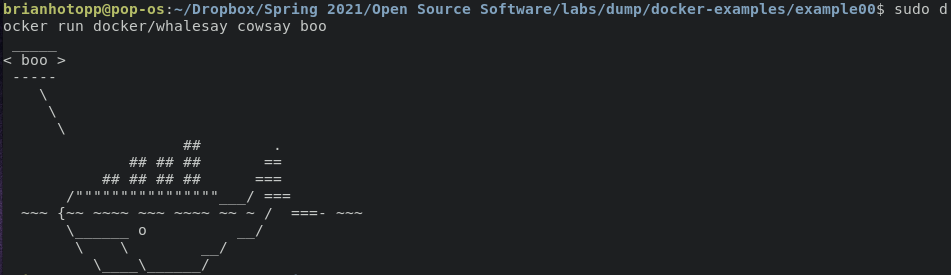

**Example 1:**

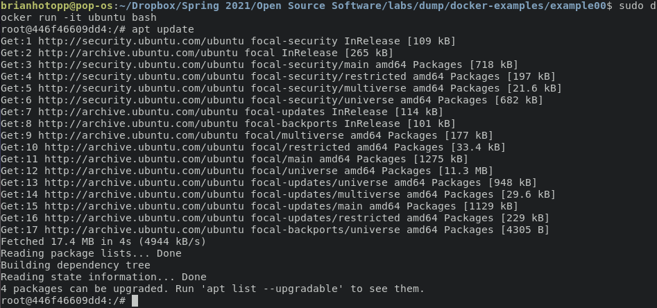

Cowsay moo!:

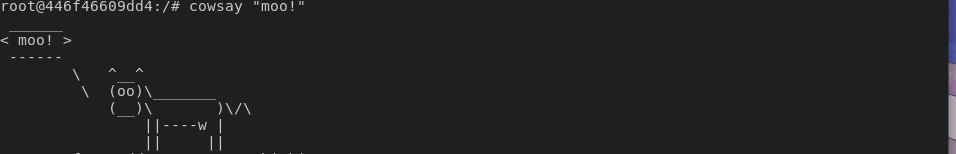

**Example 2:**

Install Mongo and run Rocket.Chat:

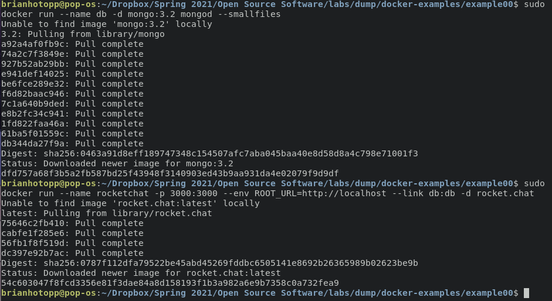

Rocket.Chat on localhost

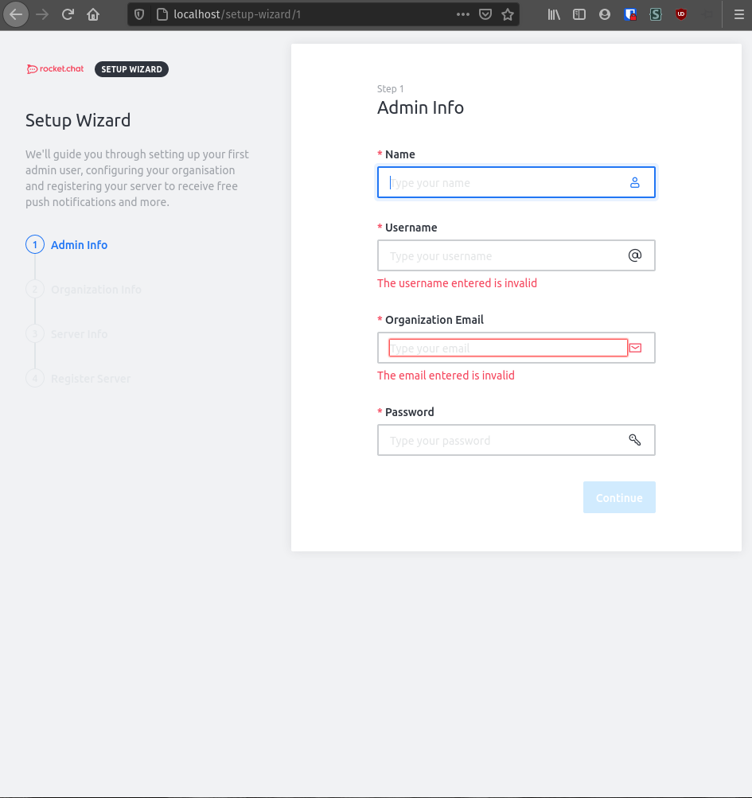

**Example 3:**

Dockerfile:

Build image:

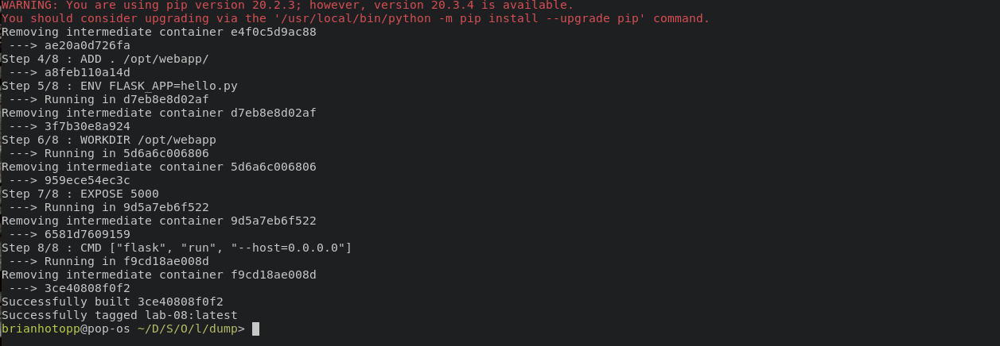

Run image:

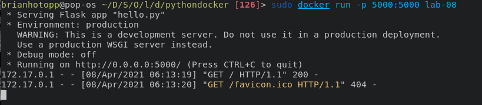

localhost:5000:

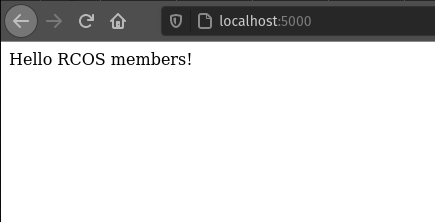

**Example 4**:

node dockerfile: 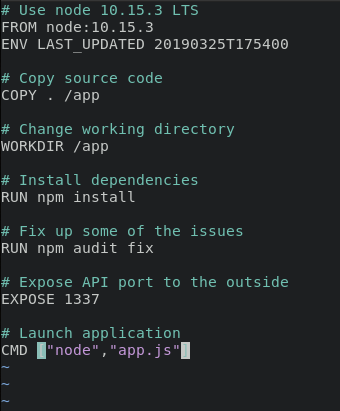

build dockerfile:

run message-app:

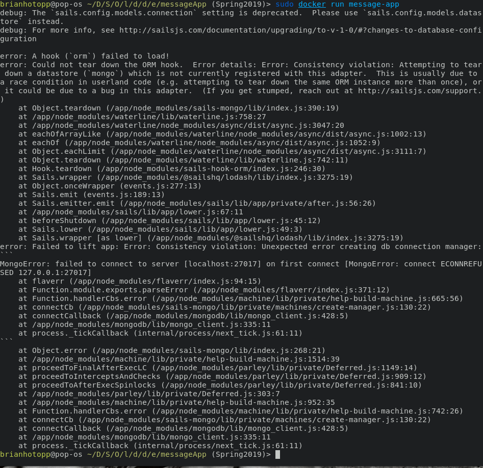

docker compose build:

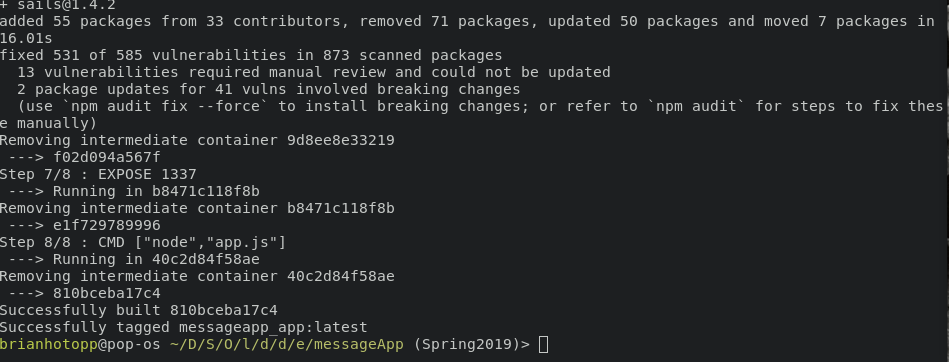

docker compose up:

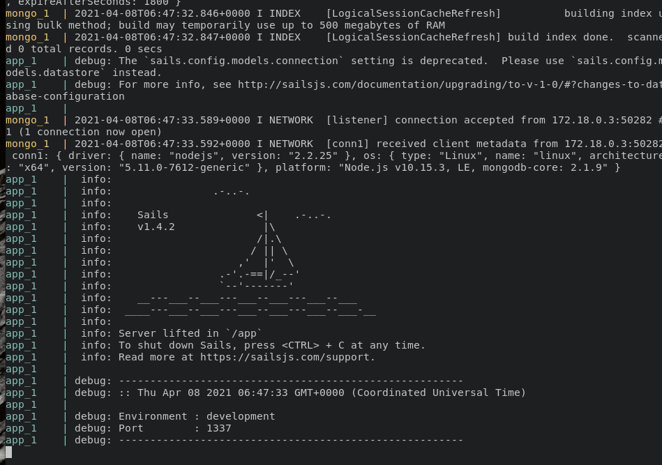

using the app:

