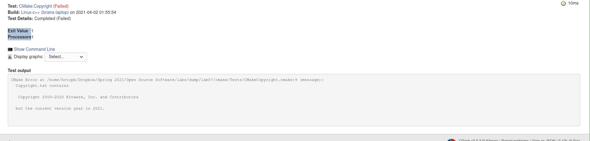
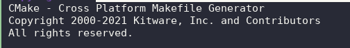
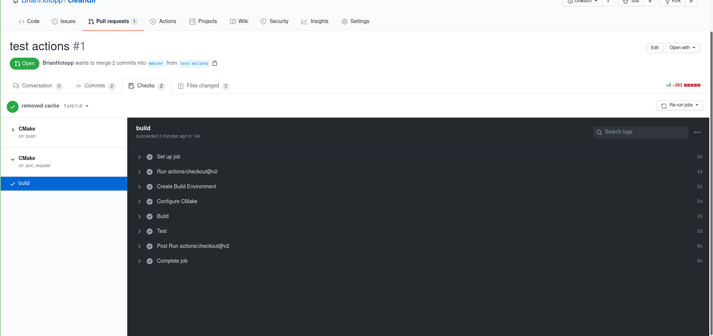
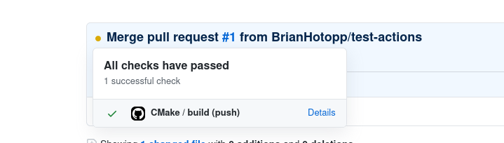

# Lab 8

**Checkpoint 1:**

Successful build:

**Checkpoint 2:**

Report on cdash:

**Checkpoint 3:**

Failing test on cdash:

Error:

Fix:

Pass:

**Checkpoint 4:**

Link to repo: https://github.com/BrianHotopp/cleandir

Tests successfully run on pull request:

Tests successfully run on merge:

Tests successfully run on push:

