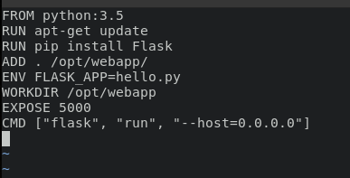
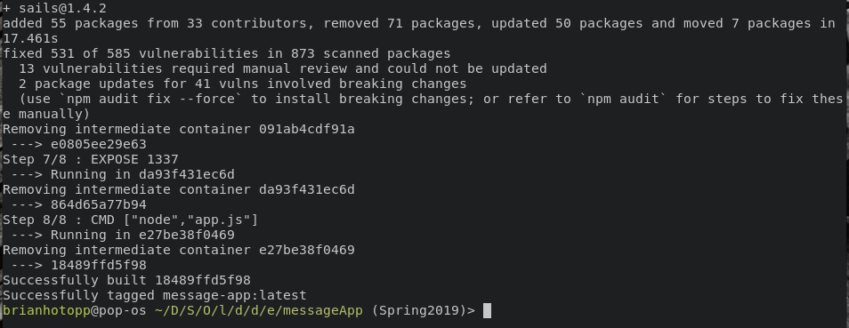
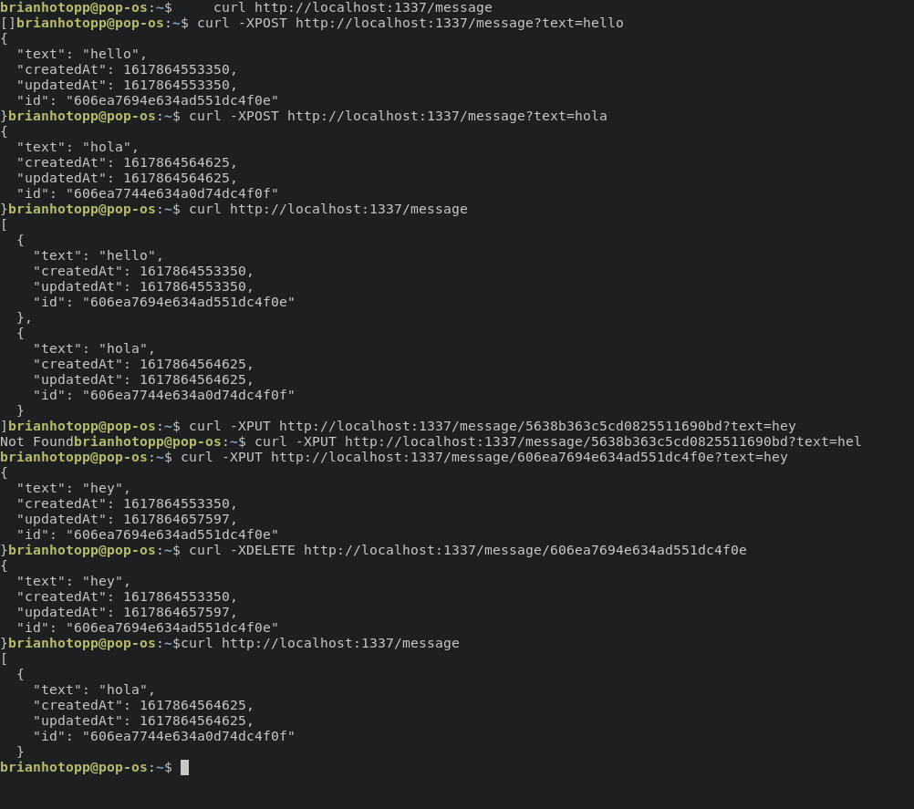

# Brian Hotopp

# OSS Lab 8

**Example 0:**

**Example 1:**

Cowsay moo!:

**Example 2:**

Install Mongo and run Rocket.Chat:

Rocket.Chat on localhost

**Example 3:**

Dockerfile:

Build image:

Run image:

localhost:5000:

**Example 4**:

node dockerfile: 

build dockerfile:

run message-app:

docker compose build:

docker compose up:

using the app:

