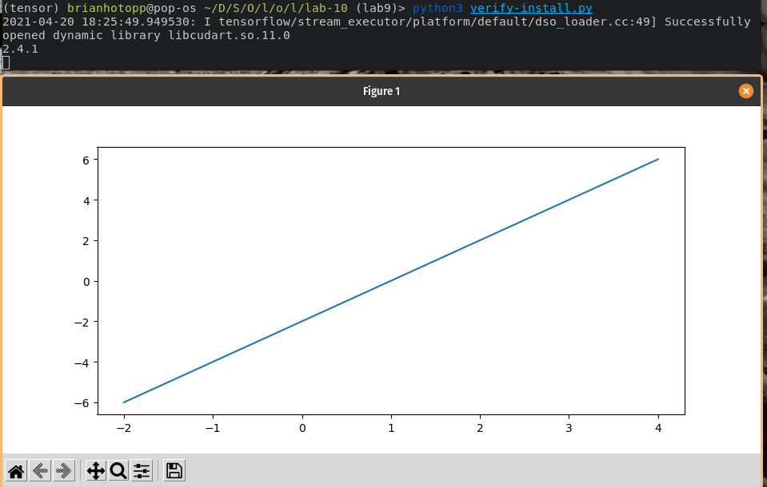
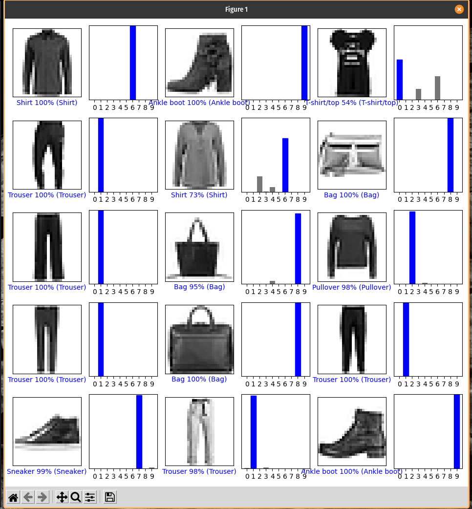
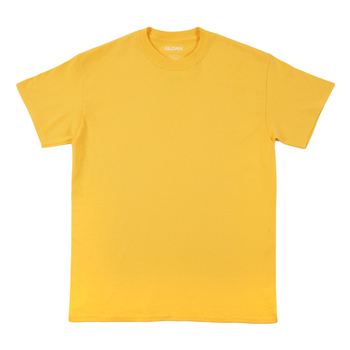
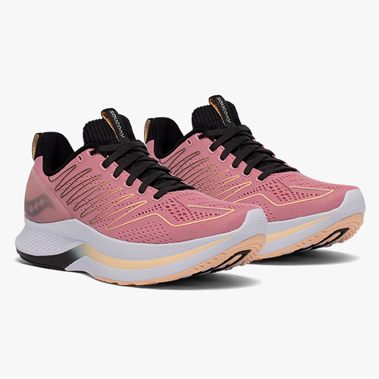
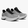

# Brian Hotopp

## Lab 10

**Checkpoint 1:**

tensorflow working:



**Checkpoint 2:**

images 9000-9014:



**Checkpoint 3:**

Pants before:


Pants after:


```
prediction
[[2.7761722e-05 9.9879849e-01 1.1129577e-05 1.1294773e-03 2.0658164e-05
  1.7032520e-10 5.0488561e-06 4.1629097e-10 7.3775659e-06 6.5402883e-10]]
1
```

Shirt before:



Shirt after:


```
prediction
[[4.0757057e-01 1.9953437e-03 6.9964431e-02 9.1883074e-03 2.7965633e-02
  4.6604238e-03 4.2450318e-01 1.7851451e-04 5.2543607e-02 1.4300725e-03]]
6
```

Shoes before:



Shoes after:


```
prediction
[[1.14860885e-01 3.94456583e-06 1.81896165e-02 4.83851472e-05
  2.65941228e-04 2.79515207e-05 4.11093980e-03 8.59584287e-03
  8.53896022e-01 4.80249128e-07]]
8
```

^ probably due to the alignment of the shoes